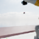
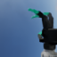

GPU validation: IsaacRTX default camera pose flag

Task: Isaac-Reorient-KukaAllegro-Camera, presets newton_mjwarp,isaacsim_rtx,cube,duo_camera,rgb64. Four environments on RTX 6000 Ada. Both update_latest_camera_pose flags remain at default False during normal environment steps.

All 40 image comparisons passed: five captures, four environments, two cameras. Each capture follows ten normal environment steps with joint actions 0.5. At each capture, normal images are copied before diagnostic changes; physics is then frozen, both pose flags enabled, and rendering pumped for 24 reference frames. Joint positions and physics-step count are asserted unchanged during reference rendering. Defaults are restored before the next ten normal steps.

Mean pixel absolute error (0–255):

| Camera | Normal vs own refreshed reference | Normal vs other reference |
|---|---:|---:|
| Base | 2.24 | 86.53 |
| Wrist | 2.54 | 86.97 |

The renderer object is shared, but each camera has its own render product. The default images track the moving wrist despite stale cached CameraData pose metadata. IsaacRTX update_camera is a no-op because it uses camera prims directly; enabling the flag refreshes metadata but does not select its rendered view.

First capture, environment zero, default base and wrist images:

The reference controls and all other unmodified PNG captures, full results.json, summary.json, and NVML log are in this directory. No other compute process was observed during validation.
